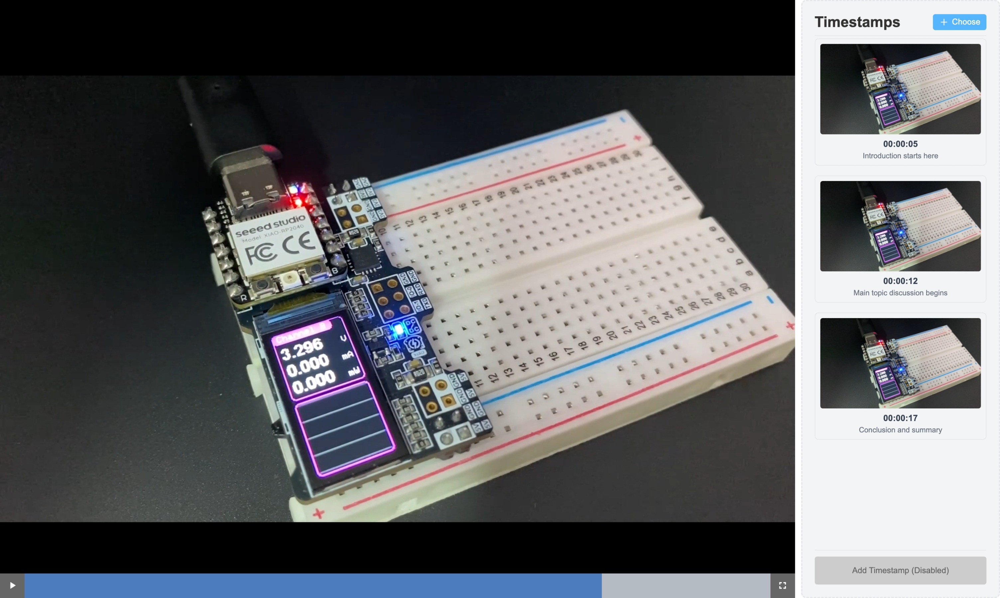

# Simple Timestamp Video Player

English | [简体中文](README_CN.md)
 
This is a simple timestamp video player that allows you to add timestamps to a video and play the video at the selected timestamp.

## How to use

- open the live web.
- click the left panel to select a video file.
- click the "Choose" button on top-right to add a timestamp json file.
- after adding the timestamp json file, it will be displayed in the timestamp panel. and take screenshot of the video at the timestamp.
- you can click the screenshot to play the video at that timestamp.

*Note: The timestamp json file should be in the following format:*
```
[
    {
        "timestamp": "00:00:00",
        "description": "This is a description of the timestamp"
    }
]
```

*Note: add timestamp function is not dev yet.*

Screenshot


> Start Page



> loaded video

License
MIT